# Hello, world! 

Nice to meet you, I'm Sneyder Barreto and I'm a Software Developer from  Colombia with a focused career trajectory in web application development using modern tech stack.

## 🔨 Technologies & Tools

These are some of the technologies and tools I use to build apps:

         

## 📈 GitHub Stats

